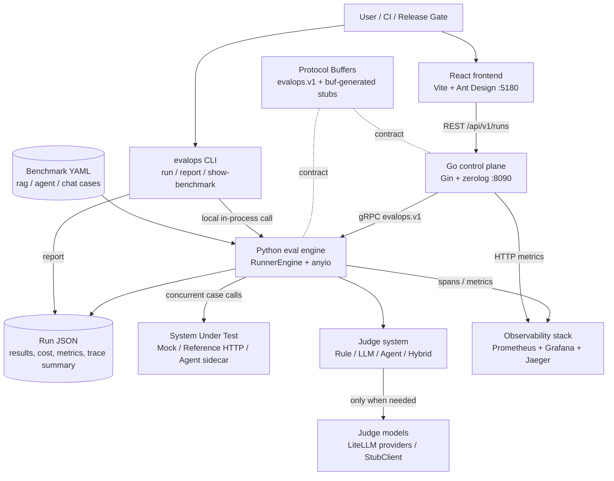
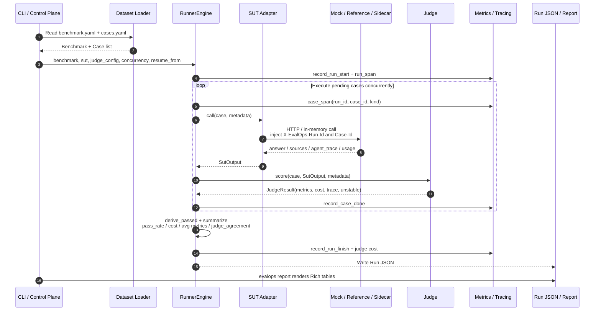
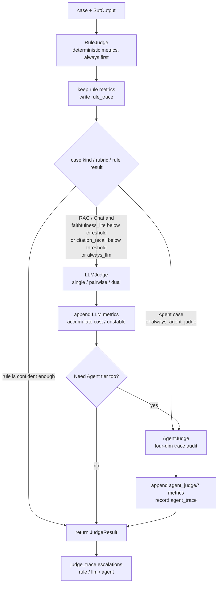
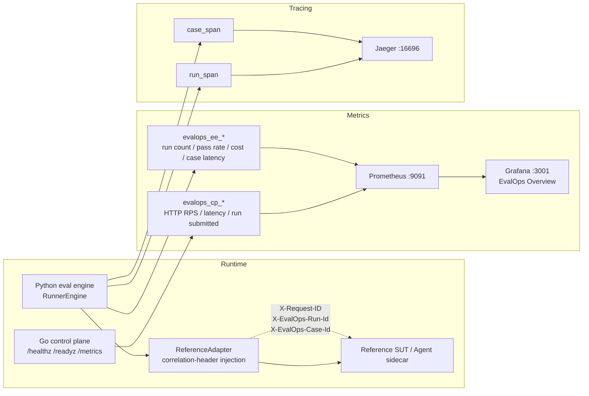
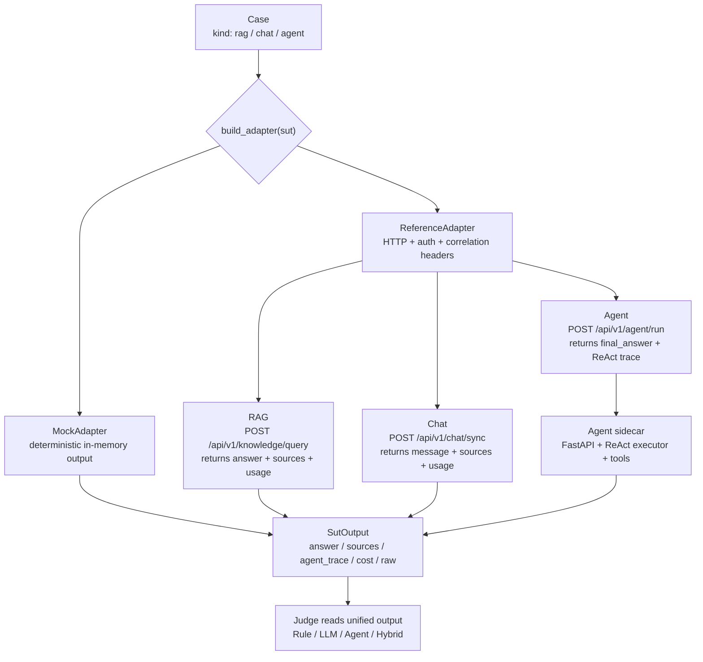

<p align="right">
  <a href="README.md">中文</a> | <a href="README.en.md">English</a>
</p>

# EvalOps

[](https://www.python.org/)
[](https://go.dev/)
[](LICENSE)
[](https://buf.build)

Systematic evaluation for Agent and RAG systems: collect samples, execute tasks, score with judges, emit metrics and traces, and replay bad cases. Results plug into Prometheus, Grafana, and Jaeger.

EvalOps focuses on hard Agent + RAG scenarios such as multi-hop reasoning.

---

## How It Differs From Existing Evaluation Frameworks

Most evaluation frameworks focus on "run a benchmark and get a score", but two problems remain unsolved:

**Offline evals vs. online distribution drift.** Once a product goes live, the evaluation set starts going stale. There is no mechanism to feed real production failures back into the benchmark.

**No closed loop.** Bad cases rot in logs instead of becoming regression tests. The next time you change a prompt or switch models, you do not know whether old failures are coming back.

| Framework | Good At | Missing |
|------|---------|--------|
| OpenCompass | Model benchmark scores | Agent behavior-chain evaluation, production observability |
| lm-eval-harness | Standardized academic benchmarks | Trace, regression, data flywheel |
| DeepEval / ragas | Single-metric RAG evaluation | Agent trace evaluation |
| AgentBench | Final-answer Agent tasks | Only checks answer correctness, not reasoning process |

EvalOps adds observability and regression to evaluation: every run emits OpenTelemetry spans and Prometheus metrics, and bad cases can flow back into the next run.

---

## Architecture



Core data flow for one evaluation run:



Three languages: Go for the control plane (Gin + zerolog), Python 3.12 for the evaluation engine (anyio + structlog + LiteLLM), and TypeScript for the frontend (Vite + React + Ant Design). Services communicate over gRPC. Protocol Buffers define the contract, and buf generates stubs.

---

## Judge System

Judges are the core of the project. EvalOps does not use the same judge for every case; it layers judges by cost and quality. If a cheap judge is enough, the expensive one does not run.

### Rule Judge - Free And Deterministic

Does not call any LLM. Dispatches by case type:

- **RAG case**: exact match, substring match, F1, citation recall, context precision, faithfulness_lite (a token-overlap proxy that catches obvious hallucinations without an LLM)
- **Agent case**: final exact match, tool selection (ordered match against expected tools), plan efficiency (expected steps / actual steps), error recovery
- **Chat case**: exact match, F1, with `non_empty` as fallback

All primitives are implemented in `metrics.py` and covered by 23 unit tests. Rule metrics always run first. Even if a later tier escalates to an LLM judge, rule results are preserved.

### LLM-as-a-Judge - LiteLLM Abstraction

LLM judges call providers through LiteLLM. Switching providers is a string change (`openai/gpt-4o`, `anthropic/claude-sonnet-4-20250514`, `zhipu/glm-4`).

Three sub-modes:

| Mode | How It Works | Bias Mitigation |
|------|---------|---------|
| `LLM_SINGLE` | One model scores with strict JSON output | `repeats` + standard-deviation threshold; high variance marks the result `unstable` |
| `LLM_PAIRWISE` | Two calls per case: SUT=A vs baseline=B, then swap | Position-bias check: if both calls vote for position A, mark TIE |
| `LLM_DUAL` | Two different providers score independently; case-level score is the mean | Run-level Cohen's kappa across all cases as an agreement proxy |

All LLM judge tests use `StubClient`, so no real API is called. Set `EVALOPS_LLM_JUDGE=stub` for CI smoke runs without API keys.

### Agent-as-a-Judge - Four Independent Dimensions

Most Agent evaluation only checks whether the final answer is correct. But an Agent can reach the right answer through broken reasoning, luck, or memorization. An answer-only judge would still give it full credit.

AgentJudge feeds the full ReAct trace to a judge model, including every thought, action, and observation, and returns four independent scores:

| Dimension | What It Catches |
|------|-----------|
| `plan_quality` | Whether task decomposition is reasonable and avoids unnecessary steps |
| `tool_selection` | Whether each tool choice and argument set is appropriate |
| `reasoning_coherence` | Whether each thought is consistent with the previous observation |
| `error_recovery` | Whether the agent retries or switches tools after failures or empty results |

Each dimension gets a 0-1 score plus rationale. `agent_judge/overall` is the weighted mean. The prompt includes 1.0 / 0.7 / 0.4 / 0.0 anchor examples for every dimension, which reduces score variance. Trace rendering clips long observations over 280 characters and caps the full trace at 40 steps.

### Hybrid Judge - Cost-Aware Escalation



Escalation is configurable. For example, RAG cases escalate to the LLM tier when `faithfulness_lite < 0.7` or `citation_recall < 0.5`; Agent cases trigger Agent-as-a-Judge by default. LLM and Agent judges are lazily instantiated only on the first case that needs escalation, so rule-only runs do not import LiteLLM.

---

## Observability



Everything runs locally (`make infra-up`) and does not depend on remote infrastructure.

**Metrics**: Go and Python each use a process-local Prometheus registry (`evalops_cp_*` and `evalops_ee_*`), which coexist in the same Grafana dashboard.

**Tracing**: `ReferenceAdapter` injects correlation headers on every call. On the Python side, every run is wrapped in `run_span`, every case is wrapped in `case_span`, and spans are exported to Jaeger.

**Grafana**: ships with an EvalOps Overview dashboard covering run submission rate, latest pass rate, cost burn rate, HTTP RPS, and p95 latency.

**CLI**: `evalops report <run.json>` renders Rich tables. When the Docker stack is not running, this is the primary observation surface.

Entry points: Grafana `:3001` (admin/admin), Prometheus `:9091`, Jaeger `:16696`.

---

## SUT Integration

Systems Under Test can be integrated in three ways:



| Adapter | When To Use |
|--------|--------|
| `MockAdapter` | Fully in-memory and deterministic. Honors `rubric.mock_mode`. Useful for unit tests and CI smoke runs without external services |
| `ReferenceAdapter` | Use when your app exposes HTTP APIs. Automatically injects headers such as `X-EvalOps-Run-Id` |
| Agent sidecar | Use when the reference app has no native Agent interface. Runs as an independent FastAPI process with a ReAct executor and 4 tools |

`MockAdapter` can deterministically reproduce failure modes (`faithful` / `hallucinate` / `refuse`).

---

## Datasets

Four benchmarks are checked in:

| Name | Size | Description |
|------|------|------|
| `rag-toy` | 4 cases | Hand-written rubric cases: normal / hallucination / unanswerable / citation recall |
| `agent-toy` | 3 cases | Tool selection, plan efficiency, error recovery |
| `hotpotqa-dev-100` | 100 cases | Real multi-hop QA benchmark, 79 bridge + 21 comparison |
| `tau-bench-lite` | 20 cases | 6 subsets: single-step / multi-hop / multi-tool / file_read / unanswerable / error_recovery |

---

## Quick Start

```bash
# 1. Environment
conda create -n evalops python=3.12 -y
conda activate evalops
pip install -e 'services/eval-engine[dev]'

# 2. Bring up the observability stack (optional)
make infra-up      # PG / Redis / MinIO / Jaeger / Prometheus / Grafana

# 3. Smoke test (no external service required)
evalops run --benchmark datasets/rag-toy --sut mock --out runs/toy.json

# 4. Inspect results
evalops report runs/toy.json
```

More commands:

```bash
# HotpotQA + mock SUT
evalops run --benchmark datasets/hotpotqa-dev-100 --sut mock --out runs/hotpot.json

# Run the Agent benchmark through the agent sidecar
scripts/deploy-sidecar.sh --reinstall
AGENT_SIDECAR_PORT=18081 agent-sidecar &
evalops run --benchmark datasets/agent-toy --sut reference \
    --sut-endpoint http://localhost:18081 --out runs/agent.json

# LLM-as-a-Judge (requires API key)
evalops run --benchmark datasets/hotpotqa-dev-100 --sut mock \
    --judge llm_single --judge-name gpt4o --out runs/hotpot-llm.json

# Dual judge (two providers, automatically computes Cohen's kappa)
evalops run --benchmark datasets/rag-toy --sut mock \
    --judge llm_dual --judge-name gpt4o-vs-claude --out runs/dual.json

# Resume
evalops run --benchmark datasets/rag-toy --sut mock \
    --resume runs/toy.json --out runs/toy-resumed.json

# CI smoke run (zero API keys)
EVALOPS_LLM_JUDGE=stub evalops run --benchmark datasets/rag-toy \
    --sut mock --judge llm_single --out runs/stub.json
```

---

## CI

Six parallel lanes (`.github/workflows/ci.yml`), with new pushes on the same branch automatically cancelling stale runs:

| Lane | Contents |
|--------|------|
| `eval-engine` | Python 3.11 + 3.12 matrix, ruff check, pytest + coverage |
| `control-plane` | Go vet / build / test -race |
| `agent-sidecar` | Import smoke test |
| `proto` | buf lint + generate; fails if generated stubs drift |
| `sidecar-sync` | Structural checks |
| `web` | npm ci + typecheck + build |

---

## CLI Reference

```
evalops run         Run a benchmark against a SUT and write a Run JSON report
  --benchmark       Benchmark directory path
  --sut             mock | reference
  --sut-endpoint    Override endpoint URL
  --judge           rule | llm_single | llm_pairwise | llm_dual | hybrid
  --judge-name      Run name
  --concurrency     SUT call parallelism (default 4)
  --max-cases       Run only the first N cases (0 = all)
  --out             Run JSON output path
  --resume          Resume from an existing Run JSON
  --log-level       INFO | DEBUG | WARNING | ERROR

evalops report      Print an existing Run JSON as Rich tables
evalops show-benchmark  dump benchmark metadata
```

---

## Local Ports

Ports deliberately avoid common defaults so two stacks can run side by side:

| Component | Port | Notes |
|------|------|------|
| Go control plane | 8090 | `/healthz`, `/metrics`, `/api/v1/runs` |
| Web frontend | 5180 | `/api` proxies to :8090 |
| PostgreSQL | 5452 | Docker |
| Redis | 6389 | Docker |
| Jaeger UI | 16696 | OTLP HTTP `:4328` |
| Prometheus | 9091 | Docker |
| Grafana | 3001 | admin/admin |
| Agent sidecar | 18081 | Started manually |

---

## License

MIT
